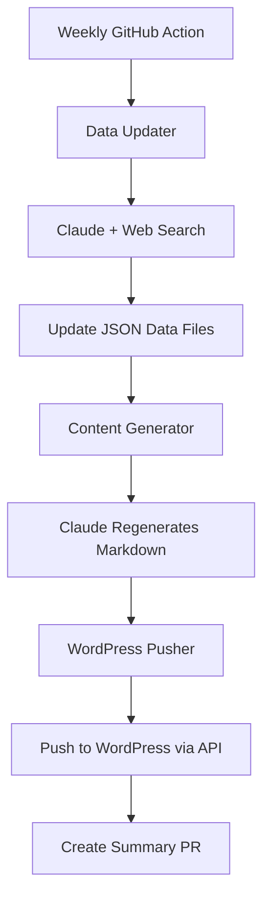

# Content Strategy and Auto-Update Pipeline

## Content Strategy Evaluation

### Current Strengths

- Consistent template structure with SEO-focused frontmatter
- Comprehensive FAQ sections that answer real user questions
- Internal linking via "Related Tools" sections
- Guide pages targeting long-tail keywords (429 errors, rate limits, pricing comparison)
- Widgets load dynamically, bypassing WordPress cache

### Issues to Fix

**Inconsistencies:**

- `page_id` missing from 4 of 8 content files (guides + landing page)
- SEO title format varies (some have "| AI-Buzz", some don't)
- Duplicate link in `ai-openai-429-errors.md` Related Tools section
- `status_providers.json` missing `update_frequency` in metadata

**Stale Data Risk:**

- Guide pages have **hardcoded tables** (rate limits, pricing comparisons) that go stale
- No "last updated" indicator visible to users
- Manual updates only - easy to forget

**Missing Content:**

- No schema.org structured data for FAQs (SEO opportunity)
- No changelog or "what's new" section

---

## Auto-Update Pipeline Architecture



### Components

**1. Data Updater** ([scripts/update_data.py](scripts/update_data.py))

- Uses Anthropic Claude with web search capability
- Updates `data/pricing_data.json` with current model pricing
- Updates `data/error_patterns.json` with new error codes
- Validates output against JSON schemas
- Preserves `_metadata` structure

**2. Content Generator** ([scripts/update_content.py](scripts/update_content.py))

- Reads updated data files
- Uses Claude to regenerate dynamic sections in content pages:
  - Pricing comparison tables in guide pages
  - Rate limit tables
  - FAQ updates based on new features
- Preserves template structure (frontmatter, widget embeds)

**3. WordPress Sync** (existing [scripts/wp_pages.py](scripts/wp_pages.py))

- Uses existing `push-all` command
- Pushes updated content to WordPress

**4. GitHub Action** ([.github/workflows/content-update.yml](.github/workflows/content-update.yml))

- Runs weekly (Mondays at 9 AM UTC)
- Creates a PR with changes for human review
- Includes summary of what changed

### Web Search Integration

Claude doesn't have native web search, so we'll integrate **Brave Search API** (free tier: 2,000 queries/month):

```python
# Pattern: Claude requests search, we execute, feed results back
tools = [{
    "name": "web_search",
    "description": "Search the web for current information",
    "input_schema": {"query": "string"}
}]
```

### Data Validation

Add JSON schemas to validate LLM-generated data:

- [data/schemas/pricing_schema.json](data/schemas/pricing_schema.json) - Validates pricing data structure
- [data/schemas/error_patterns_schema.json](data/schemas/error_patterns_schema.json) - Validates error patterns

---

## New Dependencies Required

```txt
# Add to requirements.txt
anthropic>=0.40.0          # Anthropic SDK for Claude
brave-search>=0.1.5        # Brave Search API client (or use httpx directly)
jsonschema>=4.20.0         # JSON schema validation
```

---

## File Changes Summary

| File | Action | Purpose |

| -------------------------------------- | ------ | ------------------------------ |

| `scripts/update_data.py` | Create | LLM-powered data updater |

| `scripts/update_content.py` | Create | Content regeneration |

| `scripts/orchestrate_updates.py` | Create | Main orchestrator |

| `data/schemas/*.json` | Create | Validation schemas |

| `.github/workflows/content-update.yml` | Create | Weekly scheduled workflow |

| `requirements.txt` | Modify | Add anthropic, jsonschema deps |

| `content/tools/*.md` | Modify | Fix inconsistencies |

---

## Safety Measures

1. **PR-based workflow** - Pipeline creates PR, not direct commits
2. **Human review** - All changes require approval before merge
3. **Diff preview** - PR shows exactly what changed
4. **Rollback** - Easy to revert via git if something goes wrong
5. **Dry run mode** - Test without pushing to WordPress

---

## Environment Variables Needed

```bash
# .env additions
ANTHROPIC_API_KEY=sk-ant-...      # Claude API access
BRAVE_SEARCH_API_KEY=BSA...       # Web search (free tier)
```